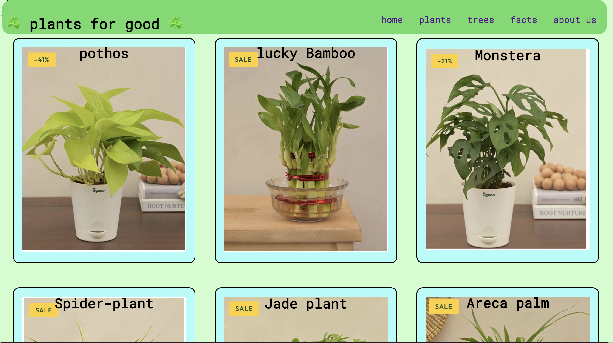

# 🌱 Plants Are Good

**Live Demo**: [Plants Are Good](https://ashish-more-02.github.io/Plants-are-good/)

---

## 📖 Overview

"Plants Are Good" is a visually appealing landing page designed to provide information about plants and their benefits. The project showcases beautiful visuals and smooth design to create an engaging user experience. It's built using fundamental web technologies like HTML, CSS, and JavaScript.

---

## 💡 Features

- 🌿 **Informative Content**: Learn about the benefits of plants in daily life.
- 🎨 **Visually Stunning**: A clean and aesthetic design with eye-catching visuals.
- 📱 **Responsive Design**: Optimized for desktop and mobile devices for a seamless experience.
- ⚡ **Interactive Elements**: Smooth scrolling, animations, and more to enhance user engagement.

---

## 🛠️ Technologies Used

- **HTML5**: For structuring the content of the page.
- **CSS3**: For styling and making the design visually attractive.
- **JavaScript**: For adding interactivity to the webpage.

---

## 🚀 How to Use

1. Visit the [live website](https://ashish-more-02.github.io/Plants-are-good/).
2. Explore the page to learn interesting facts about plants.
3. Enjoy the visuals and interactive elements.

---

## 🖼️ Screenshots

**screenshot-1**

**screenshot-2**

---

## 🔗 Links

- **Live Demo**: [Plants Are Good](https://ashish-more-02.github.io/Plants-are-good/)
- **GitHub Repository**: [Plants Are Good Repo](#) _(Add the repository link here if available)_

---

## 🤝 Contributing

If you'd like to contribute to this project, feel free to fork the repository and submit a pull request. Any feedback or suggestions are welcome!

---

## 📧 Contact

For any inquiries or suggestions, reach out to me at:  
**Ashish More** - [GitHub Profile](https://github.com/ashish-more-02)  
**email** - ashishmore2125@gmail.com

---

## ⭐ Acknowledgments

- Thanks to all the resources and inspiration that helped bring this project to life.
